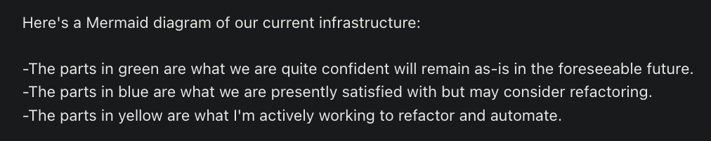
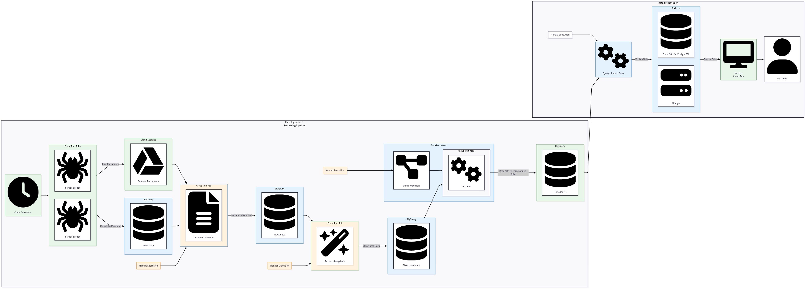
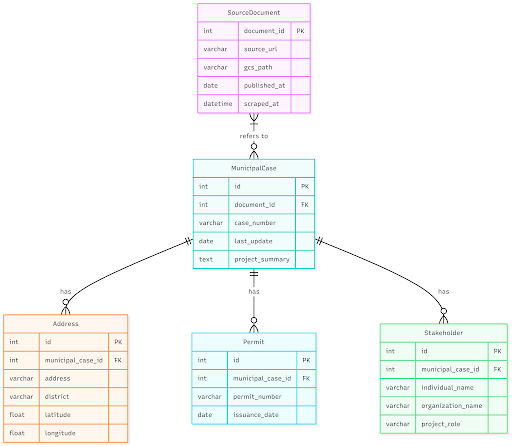

# Meeting: Presenting Iteration 1 to Stakeholder for Signoff

**Date:** 2025-10-03  
**Time:** 12:15 - 13:00  
**Attendees:** Minh, Dominic Munera, Clement Munera, Hudson, David  
**Absent:** N/A  
**Note Taker:** Minh

## Summary

The team presented the system diagrams. The stakeholder requested changes and provided significant clarifications on the nature of the documents to be scraped.

## Action Items

| Task | Doer | Status |
| --- | ---: | --- |
| Send root URLs list to the team | Dominic Munera | Done |
| Send account credentials for Google and production platform | Dominic Munera | Pending |
| Set up GitHub organization | Minh and Clement | Pending |
| Send team emails to Dominic | Minh | Pending |
| Update system architecture based on feedback | Minh | Pending |

## Discussion Points

### Critical New Information

- The documents to be scraped are a mix of everything, and it is unclear which are relevant. This requires an additional step to filter relevant information before building the tree.
- A single document can refer to one project or multiple projects.
- An address can have many projects, and a project can have multiple files ("dossiers").

### Signoff

- **Decision:** No  
- **Changes requested:**
  - The overall approach is good, but the stack needs to be rethought to match theirs.
  - Must use BigQuery, find what they did for montreal in [biquery schema json](./Munera-iteration-1-feedback/BigQuery_Schema.json)
  - Project entity needs to be redefined, as one document can refer to multiple projects.
- Comments are embedded in [system architecture pdf](./Munera-iteration-1-feedback/feedback-on-architecture.pdf)

### Stakeholder's Current Architecture

### Questions

- **Provide actual root domains to be scraped:** Stakeholder sent the urls they used for Montreal as reference. 

See [montreal urls json](./Munera-iteration-1-feedback/Montreal_URLs.json)

The team will use their crawler as the stakeholders do not have specific targets.

- **Provide example documents:** Dominic will create accounts for the team to access their production platform. Minh will collect team emails for this purpose.

An early sample can be found in [example document pdf](./Munera-iteration-1-feedback/example-document.pdf)

- **Prompts and models for parsing:** Dominic will provide these.
- **Hudson's Questions:**
  - **Should the scraper collect all available projects once (backfill) and then run continuously to add new projects, update existing ones, and mark cancelled projects?**
    - Currently, the Montreal scraper runs weekly on Mondays. No city has a dedicated portal for construction projects. The PDFs contain various requests, not just construction-related ones.
  - **Do we need a back-end engine that constantly monitors sources, compares changes, and updates the database automatically?**
    - They use Scrapy to avoid duplicate work.
  - **How many projects have already been scraped for Montreal in the database, to get a sense of the scale and growth rate?**
    - Approximately 2,500 projects over 10 years, with an average of 250 projects per year. Montreal primarily focuses on reconversions, while smaller towns like Brossard are building new projects.
  - **Which fields should every project ideally include?**
    - The schema will be provided.
  - **How many sites were crawled for Montreal?**
    - Clement will send the URL list for Montreal.
  - **If a project lacks some fields, should we still include it in the database with placeholders (null values) and update later when new data appears?**
    - Null values are used, and such projects do not appear in the frontend.
  - **Does “real estate and infrastructure projects” mean buildings only (institutional, industrial, residential, commercial, mixed-use)?**
    - It includes construction, demolition, renovation, and additions. Institutional projects like bridges and roads are included, but only during the construction phase.
  - **Testing methodology?**
    - No TDD. Unit tests are done with pytest, and integration tests are manual. The team can decide on additional testing methods.

### Documents to Sign

- Stakeholder responsibilities.
- VPRGS-9.

### Accounts

- **Google:** The team has an account but needs to review permissions.
- **GitHub organization:** Minh and Clement will meet to set this up.
- **Discord:** Stakeholders have joined the platform. [Discord Link](https://discord.gg/4jwb9VdApy).
